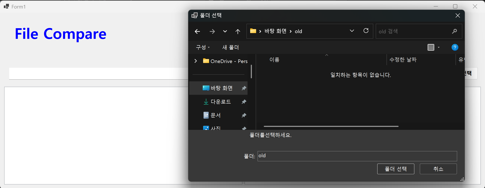
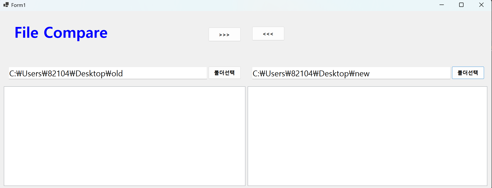
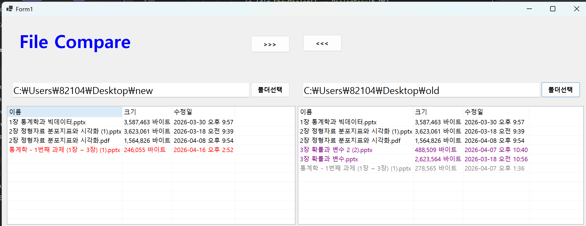

# (C# 코딩) 파일 비교 툴 (FileCompare)

## 개요
- C# 프로그래밍 실습: 시스템에 존재하는 폴더를 탐색하고 선택하여 내부 파일 목록을 표시하며, 두 위치의 파일을 상호 비교하는 기술을 실습합니다.
- 1줄 소개: 두 폴더를 실시간으로 비교하여 최신 버전의 파일을 판별하고, 안전하게 복사 및 백업할 수 있는 버전 관리 보조 도구입니다.
- 사용한 플랫폼: C#, .NET Windows Forms, Visual Studio, GitHub
- 사용한 컨트롤:
    - 레이아웃: SplitContainer (화면 분할), Panel (구역 구조화)
    - 입출력: ListView (Details 뷰), TextBox (경로 표시), Label (앱 타이틀)
    - 동작: Button (폴더 선택 및 복사), FolderBrowserDialog (폴더 탐색 대화상자)
- 사용한 기술과 구현한 기능:
    - 효율적 파일 탐색: EnumerateFiles와 EnumerateDirectories를 사용하여 대량의 파일도 UI 멈춤 현상 없이 빠르게 목록화하는 스트리밍 기술을 적용했습니다.
    - 응답형 UI 디자인: Dock과 Anchor 속성을 활용하여 사용자가 창 크기를 조절하더라도 내부 컨트롤들이 일정한 비율과 위치를 유지하도록 설계했습니다.
    - 상태 기반 시각화 시스템: 파일의 수정 시간(LastWriteTime)을 분석하여 동일 파일, 최신 파일(빨간색), 이전 파일(회색), 단독 파일(보라색)로 상태를 구분해 시각적 편의성을 높였습니다.
    - 지능형 덮어쓰기 보호: 원본 파일이 대상 파일보다 오래된 버전일 경우에만 확인 메시지 박스를 호출하여 소중한 데이터를 보호하는 방어적 로직을 구현했습니다.
    - 예외 처리 및 안정성: 폴더 접근 권한이나 입출력 오류 발생 시 프로그램이 강제 종료되지 않도록 try-catch-finally 구문을 철저히 적용했습니다.

---

## 실행 화면 (과제1)
- 코드의 실행 스크린샷과 구현 내용 설명

- 구현한 내용 (위 그림 참조)
    - SplitContainer 컨트롤을 메인 컨테이너로 사용하여 화면을 좌우로 명확히 분리하고, 구분선을 통해 사용자가 영역 크기를 직접 조절할 수 있게 했습니다.
    - 각 분할 영역 내부에 상단(앱 타이틀), 중간(경로 입력), 하단(파일 리스트) 영역을 Panel 컨트롤로 계층화하여 논리적 구조를 완성했습니다.
    - 하단 패널의 Dock 속성을 Fill로 설정하여 창 크기가 커질 때 파일 목록 창도 함께 확장되도록 가변 레이아웃을 적용했습니다.
    - ListView에 이름, 크기, 수정일 컬럼을 추가하고 View를 Details로 설정하여 파일 탐색기와 동일한 정보 밀도를 확보했습니다.

---

## 실행 화면 (과제2)
- 코드의 실행 스크린샷과 구현 내용 설명

- 구현한 내용 (위 그림 참조)
    - btnLeftDir 및 btnRightDir 버튼 클릭 시 FolderBrowserDialog를 호출하여 사용자가 시스템의 폴더를 직관적으로 선택할 수 있도록 구현했습니다.
    - 선택된 폴더의 절대 경로를 TextBox에 즉시 출력하고, 해당 경로 내의 모든 파일 정보를 추출하여 ListView 아이템으로 변환하는 리스트 업 로직을 완성했습니다.
    - 파일 비교 로직을 통해 양쪽 폴더를 상호 대조하며, 수정 날짜가 더 늦은 최신 파일을 빨간색으로 강조 표시하여 업데이트 대상을 한눈에 파악할 수 있게 했습니다.
    - 존재하지 않는 폴더 경로 입력 시 예외 처리 메시지를 출력하여 프로그램의 무결성을 유지했습니다.

